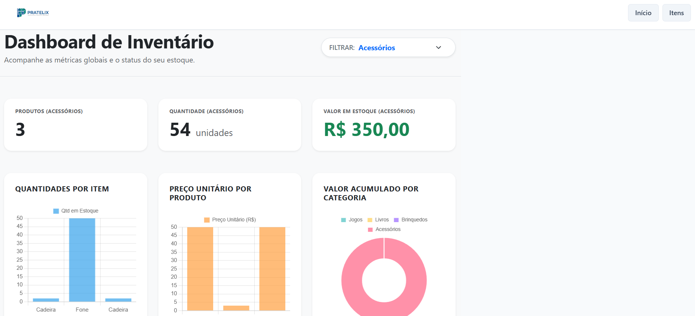
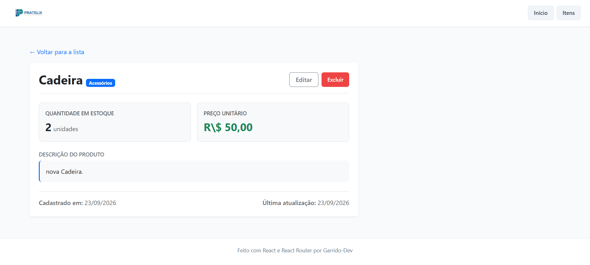

# 📦 Pratelix - Gestão Inteligente de Estoque

O **Pratelix** é uma aplicação web completa desenvolvida para facilitar o controle, monitoramento e gerenciamento de estoques de forma intuitiva e visual. O projeto conta com um dashboard interativo repleto de gráficos informativos, suporte a categorias, precificação e persistência de dados no navegador.

🔗 **Acesse o projeto online:** [Pratelix na Web](https://garrido-dev.github.io/Pratelix/)

---

## 📸 Demonstração em Imagens

| Dashboard Principal | Visualização Individual do Item |
| :---: | :---: |
|  |  |

---

## 🚀 Funcionalidades Principais

* 📊 **Dashboard Interativo:** Painel inicial com indicadores de desempenho e múltiplos gráficos analíticos sobre a distribuição do estoque.
* 📋 **Listagem Completa de Produtos:** Tabela dinâmica para visualização de todos os itens cadastrados com suporte a busca/filtragem.
* 🔎 **Visualização Detalhada (Item View):** Página dedicada para inspecionar informações específicas de um único produto.
* ➕ **Cadastro & Edição de Itens:** Formulário com validação para inclusão e atualização de produtos, categorias e valores.
* 💾 **Persistência Local (LocalStorage):** Os dados do estoque permanecem salvos no navegador, mantendo as informações mesmo após recarregar a página.
* 🎨 **Interface Responsiva:** Design limpo e adaptável para diferentes tamanhos de tela.

---

## 📊 Visualizações e Gráficos (Dashboard)

Com o suporte da biblioteca **Chart.js**, a Home do Pratelix fornece insumos visuais essenciais para tomada de decisão:
* **Distribuição por Categoria:** Gráficos que demonstram a quantidade de itens alocados em cada categoria.
* **Métricas Financeiras:** Análise visual sobre valor investido por produto e acumulado total em estoque.
* **Status Geral do Estoque:** Alertas e indicadores visuais para itens com baixo estoque ou fora de linha.

---

## 🛠️ Tecnologias e Bibliotecas Utilizadas

* **[React](https://react.dev/):** Construção da interface baseada em componentes reutilizáveis.
* **[Chart.js](https://www.chartjs.org/) / [react-chartjs-2](https://react-chartjs-2.js.org/):** Geração de gráficos dinâmicos para o Dashboard.
* **[Bootstrap](https://getbootstrap.com/):** Agilidade no layout e estilização moderna de componentes UI.
* **[CSS Modules](https://github.com/css-modules/css-modules):** Estilização escopada e isolada por componente.
* **JavaScript (ES6+):** Lógica de negócios, manipulação de arrays e POO (Orientação a Objetos).

---

## 🧠 Aprendizados & Conceitos Aplicados

Este projeto representou um divisor de águas no meu aprendizado em ecossistema React. Durante o desenvolvimento, foi possível exercitar na prática:

1. **`useState`:** Gerenciamento do estado local de formulários, inputs e variáveis de controle da interface.
2. **`useEffect`:** Ciclo de vida dos componentes, sincronização de dados com o `localStorage` e renderização de gráficos.
3. **`useContext` (Context API):** Criação do `StockContext` para disponibilizar o estado do estoque de forma global, eliminando o *prop drilling* entre as páginas e componentes.
4. **Manipulação do LocalStorage:** Persistência dos dados da aplicação no próprio navegador do usuário em formato JSON.
5. **Integração com Bibliotecas de Terceiros:** Consumo e configuração do Chart.js integrado à reatividade do React.

---

## 📁 Estrutura do Projeto

```text
src/
├── assets/              # Imagens e recursos estáticos
├── components/          # Componentes reutilizáveis (Tabelas, Gráficos, Formulários)
├── contexts/            # Context API para gerenciamento global de estado (StockContext)
├── entities/            # Classes e modelos de dados JS (StockItem)
├── pages/               # Páginas da aplicação (Dashboard, Lista, Novo Item, Detalhes)
├── App.jsx              # Rotas e estruturação principal
└── index.css            # Estilos globais da aplicação
```

---

## 💻 Como Executar o Projeto Localmente

### Pré-requisitos
* **Node.js** instalado na máquina (versão 16 ou superior).
* Gerenciador de pacotes **npm** ou **yarn**.

### Passo a passo

1. **Clone o repositório:**
   ```bash
   git clone https://github.com/seu-usuario/Pratelix.git
   ```

2. **Acesse o diretório do projeto:**
   ```bash
   cd Pratelix
   ```

3. **Instale as dependências:**
   ```bash
   npm install
   ```

4. **Execute o servidor de desenvolvimento:**
   ```bash
   npm run dev
   ```

5. Acesse o endereço informado no terminal (ex: `http://localhost:5173`) no seu navegador.

---

## ✉️ Contato & Redes

Desenvolvido por **Garrido**! 🚀

* **GitHub:** [@garrido-dev](https://github.com/garrido-dev)
* **Projeto Online:** [Acesse aqui](https://garrido-dev.github.io/Pratelix/)
